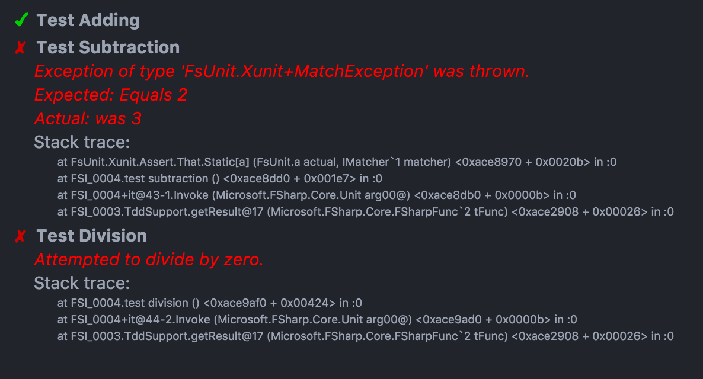

# FsiTdd

## TDD support scripts for F# interactive

Open TddSample*.fsx and send the entire contents to FSI.  If you are using Ionide, you will see output in HTML format.  As you update code or tests, you need only send the changes to FSI.  This allows for a lightning fast feedback loop as you move from failing test to passing test.



This repo may someday be converted into a Nuget package, but for the moment I think it is likely enough that people will want to make changes that I recommend copying or forking the repo.

## Test discovery modes

There are multiple ways to set up your TDD file and discover tests:

### Expr / Quotations

Call TddSupport.runTestsExpr with a list of quotations representing the tests you want to run. Each quotation needs to be a (unit -> unit). E.g.,

```
let testStuff1() =
  // test code
let testStuff2() =
  // test code
  
TddSupport.runTestsExpr [
  <@ testStuff1 @>
  <@ testStuff2 @>
]
```

See TddSampleExpr.fsx.

### Type

Call TddSupport.runTestsObject with an object that has test methods and a list of the names of tests you want to run. If the list is empty all public instance methods declared directly on the type (not inherited) will be run.

```
type HasTests() =
  member x.testMethod1() =
    // test code
  member x.testMethod2() =
    // test code

Call TddSupport.runTestsObject HasTests() [
  "testMethod1"
  "testMethod2"
]
```

See TddSampleType.fsx.

### Manual

Ultimately, both runTestsExpr and runTestsObject call runTests, which takes a list of ReplTest:

```
{ Name : string, Test : unit -> unit }
```

You can use any method you prefer to create these objects, or specify them manually:

```
let test1 = {
  Name = "test1"
  Test = (fun _ -> 2 + 2 |> should equal 4)
}
let test2 = {
  Name = "test2"
  Test = (fun _ -> 2 * 2 |> should equal 4)
}
TddSupport.runTests [ test1 ; test2 ]
```

See TddSampleManual.fsx.
